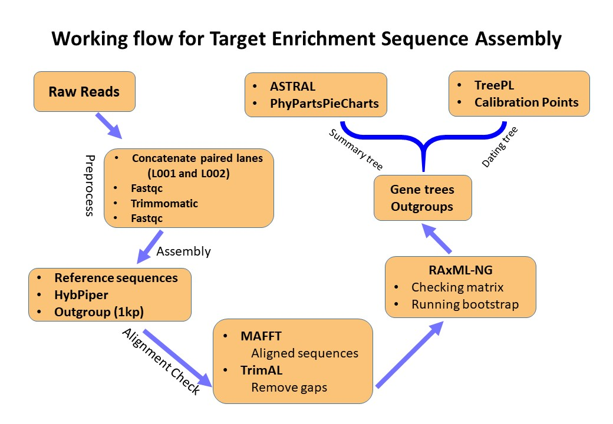

  
  
_**This page is used to document steps of processing target enrichment reads from raw reads all the way down to phylogenetic tree reconstruction.**_  

_Most scripts used here are wrotten in bash/shell and R_  

_I also made some assumptions that:_  

  + You are working on [HiPerGator](https://www.rc.ufl.edu/services/hipergator/) at Uiversity of Florida  
  
  + I applied the same rule to name our files and your file tree is the same as mine (see below)
  
  + Using [Universal Probe Set for Targeted Sequencing of 353 Nuclear Genes](https://academic.oup.com/sysbio/article/68/4/594/5237557)  
  
  
### General workingflow  

  

  

## Data

The data used in this instruction was generated by [RAPiD Genomics](www.rapid-genomics.com).  

Within the data directory there is a SampleSheet **csv** file with the barcodes, filenames, and sample codes.   

_**Note that Plates1-4 were sequenced on two lanes (L001 and L002), so there are two sets of fastq files per sample.**_

 

**Raw Data:**  

*  This data has been demultiplexed using Illuminas BCLtofastq. No quality trimming or processing has been done beyond demutiplexing. 

* The adapters used are below, _"BCBCBCBC"_ stands for the barcodes.

  + i7: GATCGGAAGAGCACACGTCTGAACTCCAGTCAC-BCBCBCBC-ATCTCGTATGCCGTCTTCTGCTTG

  + i5: AATGATACGGCGACCACCGAGATCTACAC-BCBCBCBC-ACACTCTTTCCCTACACGACGCTCTTCCGATCT

## Assembly methods

Currently, Three ways you can analyze high-throughput sequencing reads using target enrichment:  
  
  1. HybPiper 
  
  [Publication](https://bsapubs.onlinelibrary.wiley.com/doi/full/10.3732/apps.1600016)  
  
  [Code in github](https://github.com/mossmatters/HybPiper)  
  
  
  2. aTRAM  
  
  [Publication](https://journals.sagepub.com/doi/10.1177/1176934318774546)  
  
  [Code in github](https://github.com/moskalenko/aTRAM)  
  
  
  3. SECAPR  
  
  [Publication](https://peerj.com/articles/5175/)  
  
  [Code in github](https://github.com/AntonelliLab/seqcap_processor)  
  
  
  
  
  \#######################################  
  
  __In this tutorial, I only focus on [HybPiper](https://github.com/mossmatters/HybPiper)__  
  
  \#######################################

  

  
### HybPiper   

  **Preprocess:**  
  
  1. Concatenate all lanes (L001 and L002; only if you have them on separate plates!)   
    Example,  
    
    `cat RAPiD-Genomics_F076_UFL_###_P003_WD02_i5-503_i7-72_S22_L001_R1_001.fastq.gz RAPiD-Genomics_F076_UFL_###_P003_WD02_i5-503_i7-72_S60_L002_R1_001.fastq.gz > P003_WD02_72_R1.fastq.gz`  
    
    
  or run in a batch manner:  
    
    `bash fastq_lane_cat.sh sample_ID_file Seq_ID_table`  
    
    
   Example,    
    
    `bash fastq_lane_cat.sh Evgeny_13.txt UFL_394803_SampleSheet.csv`  
    
    
  This bash script will take two input files: one is sample ID file, and the other is sequence ID table. The formact and content of each file is as shown below:   
  
  
  Example,   
  [cactus]$ `head -6 XXX_88.txt`
      CPG00213
      CPG00216  
    
  [cactus]$ `head -6 UFL_XXX_SampleSheet_XXX86.csv`
  RG_Sample_Code,Customer_Code,i5_Barcode_Seq,i7_Barcode_Seq,Sequence_Name,Sequencing_Cycle
      
  UFL_394803_P002_WG08,D_4566,TAAGATTA,TTCACGCA,RAPiD-Genomics_F076_UFL_394803_P002_WG08_i5-506_i7-68_S171_L001_R1_001.fastq.gz,2x150
       ...
      
  UFL_394803_P002_WG12,D_4571,TAAGATTA,CGCATACA,RAPiD-Genomics_F076_UFL_394803_P002_WG12_i5-506_i7-42_S175_L001_R1_001.fastq.gz,2x150  
    
  3. **fastqc** to quick check the quality; and later on can be used for comparison after trim and clean.  
  * scripts needed:  
    fastqc.sh check_result.sh mean.R
  
  Example,  
  
  `module load ufrc fastqc`  
  `srundev -t time`  
  `fastqc *.gz -o FastQC_result`  
  
  For slurm job scripts see:  
  
  **fastqc.sbatch** [./Scripts/fastqc/fastqc.sbatch]  
  
  + after runing _fastqc.sh_, it will put fastqc results into a folder called _FastQC_result_;
  + Copy scripts _check_result.sh_, and _mean.R_, into _FastQC_result_, then excute the bash script, it will generate a summary table _Illumina_FastQC_report.csv_ for reads quality. Other details see folder _unzip_file_.   
  
     **note:**
    + _check_result.sh_ and _mean.R_ have to work together, you have to put them under the same directory  
    + the R script is automatically invoked, you don't need to modify anything.  
    + here is the example cmd (assuming you are in _FastQC_result_ folder)
      `cp /path/to/scripts/check_result.sh /path/to/scripts/mean.R .`  
    
      `bash check_result.sh`  

  4. Trim and clean reads using Trimmomatic, and preapre for next step --- Hybpiper.  
 
  * scripts needed:  
  
    Trimmomatic.sbatch  
    
    _If you have a few sample you can just run `bash Trimmomatic.sh` on dev node, which is not necessary to schedule a slurm job._
    
    For large number of samples, submission to SLURM in HPC is required.
  * run: `sbatch Trimmomatic.sbatch`   
    _modify the recources requested to suit for your samples_  

  
  **Sequence Assembly using Hybpiper:**  
  
  5. run hybpiper  
  nohup bash HybPiper_summary.sh Lucas27 &
  6. if want introns run intron script on accession folders out putted from previous step  
  
  7. to retrieve the supercontig sequences from the above run  put them all in one place (so `mv P*W* seq_dir`):  
   `module load python`  
   `python HybPiper/retrieve_sequences.py baits1.fasta seq_dir dna`  
    _just exons use DNA, if you run intronerate use supercontig_  
    

  **Alignment**  
  
  8. run mafft script on individual gene
  9. Phyx --- rename sequence names  
  10. TrimAL --- remove gaps in the alignment 
    
  **Outgroup**  
  _skip this step if you already have outgroup data from Target Enrichment or don't neeed 1kp data_  
  
  Beside the data generated from Target Enrichment of 353 universial probe sets, I also included some species with [1kP transcriptome data](http://www.onekp.com/public_data.html) as Outgroups.  
  
  Given I have no pre-knowledge, of how 1kP transcriptome data will be compatible with alignments of 353 nuclear genes, so I used reference sequences of 353 nuclear genes to assemble 1kP data of those outgroup species in two ways. Then I aligned them, comapred and select one of best, or I choose the consensus sequence using Geneious.  
  
  + [raw reads](http://www.onekp.com/public_read_data.html)  
  
  + [SOAPdenovo Assembly](http://www.onekp.com/public_data.html)   
  
  
  
  **RAxML-NG**  
  10. run raxml  
  
  Three scripts used (./Scripts/raxml-ng/):  
  
  + `raxmlng_laucher.sh`  
    
  + `raxml_NG_check.sbatch`  
    
  + `raxml_NG_model.sbatch`  
  
  These three scripts will run sequentially. By providing a list with all the genera, `raxmlng_laucher.sh` will go through each genus folder, creacte a "raxml" folder (where the raxml tree recontruction will happen), and looking for how many gene alignments were assembled for each genus; these numbers will be insert as a array job parameter for the first raxml script `raxml_NG_check.sbatch`.    
  
  For each alignment, `raxml_NG_check.sbatch` will run raxml-ng "--parse" checking, for purpose that:  
  
  -  MSA sanity check (see  [Tutorial](https://github.com/amkozlov/raxml-ng/wiki/Tutorial))   
    
  - Compress alignment patterns as RAxML Binary Alignment (.rba file)  
      _It will laoding faster for raxml, comapared to FASTA or PHYLIP (see [Tutorial](https://github.com/amkozlov/raxml-ng/wiki/Tutorial) )_  
      
  - Getting estimated computation recources (e.g., Model, memory, and optimal number of CPUs/threads)  
    
   _If the script detected that one alignment required larger mem (default is **1g** ) or more threads (default is  **1** ), then it will lauch the third Script `raxml_NG_model.sbatch`, otherwise it will complete the job using current script with  configurarion of default computation recource requirest_

If the third script `raxml_NG_model.sbatch` is launched, it will submit a new independent slurm job, with updated computation recources request based on the "--parse" results from `raxml_NG_check.sbatch` script.  

**Acknowledgements**   

[Rebecca L. Stubbs](http://www.rebeccalstubbs.com/) & 
[Johanna R Jantzen](https://www.johannajantzen.com/about-me.html) 
_sharing her modified scripts for runing [PhyPartsPieCharts](https://github.com/mossmatters/MJPythonNotebooks/blob/master/BakingPieCharts.ipynb)_  

[Andre A Naranjo](https://scholar.google.com/citations?user=iabk-6MAAAAJ&hl=en)  
_sharing slurm job scripts for running Hybpiper_  

[Matt Gitzendanner](https://magitz.biology.ufl.edu/home/)  
_helping with the slurm job schedule and raxml-ng MPI issues and other miscellaneous trouble shooting_
